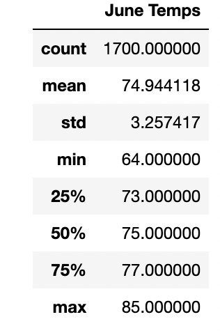
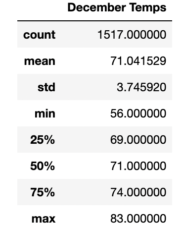
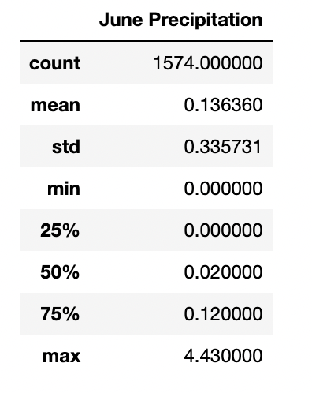
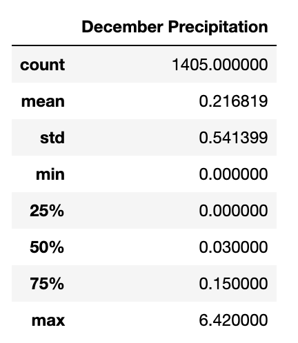

# surfs_up

## Project Overview

To open the surfboard and icecream shop "Surf n Shake" in Oahu, Hawaii, our stakeholder needs investor backing. Our prospective investor W. Avy is interested in knowing the weather data since he does not want the business to get rained out. He specifically wants to know the temperature data for the months of June and December in Oahu, in order to determine if the surf and ice cream shop business is sustainable year-round.

## Results 

 

From the statistical analysis, three key differences in weather in June and December emerge:

- The average temperature in June is 74.9 degrees. This is only a difference of ~3.9 degrees compared to December. 
- The range in temperatures in December is greater than the range of temperatures in June. You can see this not only in comparing the difference of minimum and maximum temperature per month (21 degrees in June, 27 degrees in December), but also rin a larger standard deviation in December compared to June. 
- Although there is a small difference in mean and standard deviation, the temperature seems to be consistent in Oahu.

## Summary 

In summary, based on the descriptive statistics of both June and December, Oahu has temperature conditions that would support investing in the Surf n Shake. The weather for both months have a mean and median (50%) in the 70s which is nice for both surfing and ice cream.

However, before investing I would look at the precipation statistics for both June and December.

 

As you can see the precipitation statistics for the months of June and December are low so Surf N Shake would not be rained out. Surf N Shake looks like a great investment!

